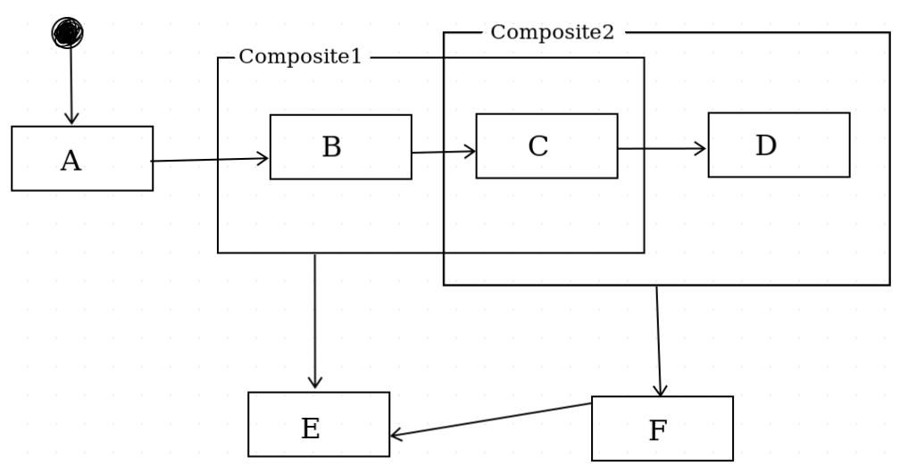
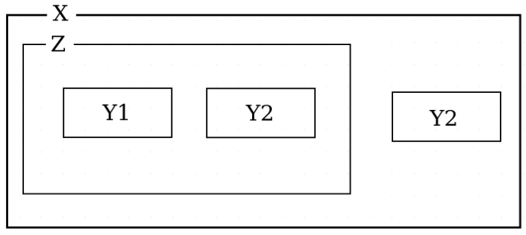
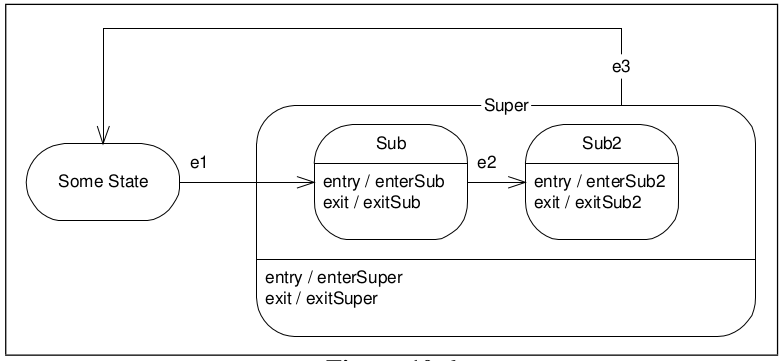

# Design Document for Adding Diagramming Language Generation

<header style="font-family: monospace;">
  <p>Name: Mohamed M. Sallam</p>
  <p>Email: muhd [dot] sallam [at] gmail [dot] com</p>
  <p>LinkedIn: <a href="https://linkedin.com/in/muhd-sallam">linkedin.com/in/muhd-sallam</a></p>
</header>

## TL;DR;
We want to add diagramming language support for StateLang (aka, cc_smc), 
the available diagramming languages for now are Mermaid and PlantUML. In 
this document we will discuss each and their features and how to generate
code in these languages.

## Perquisites
1. Skim the document before fulfill the below perquisites, so
   you have an idea what to focus on during the fulfillment of the 2nd
   perquisite.
2. Watch 28, 29 and 30 videos of Clean Code Video Series by Uncle Bob 
   **and** read the source code during watching.
3. Read cc_smc `README.md` file.

## Important Backgrounds
### Semantic DSs
There are two Semantic Data Structures produced by StateLang: 
1. `SemanticStateMachine`:
    - Produced by `SemanticAnalyzer`.
    - A structure mapping a human-intuitive valid StateLang syntax. 
      This means that all abstract and super states, entry and exit actions,
      and multiple inheritance **won't** be reduced to more simple, but
      non-human-intuitive, states.  
      Example:
      ```
      {  
        (ib1) >ib1x - - -  
        (ib2) : ib1 >ib2x - - -  
        (ib3) : ib1 >ib3x - - -  
        (sb1) <sb1n - - -  
        (sb2) :sb1 <sb2n - - -  
        (sb3) :sb1 <sb3n - - -  
        i:ib2 :ib3 >x e s a  
        s :sb2 :sb3 <n e i -
      }
      ```
      This code will be stored in our `SemanticStateMachine` DS as it is.
2. `OptimizedStateMachine`:
    - Produced by `Optimizer`.
    - A structure mapping an optimized version of the valid user code.
      This means that all abstract and super states, entry and exit actions,
      and multiple inheritance **will be** reduced to more simple, but
      non-human-intuitive, states.  
      Example:  
      This is the human-intuitive code -I know this is not look like that 
      but this is because I didn't use a real-world example-:
      ```
      {  
        (ib1) >ib1x - - -  
        (ib2) : ib1 >ib2x - - -  
        (ib3) : ib1 >ib3x - - -  
        (sb1) <sb1n - - -  
        (sb2) :sb1 <sb2n - - -  
        (sb3) :sb1 <sb3n - - -  
        i:ib2 :ib3 >x e s a  
        s :sb2 :sb3 <n e i -
      }
      ```
      `Optimizer` will reduce it to `OptimizedStateMachine` DS which is 
      look like this when we convert it to code:
      ```
      i {
        e s {x ib3x ib2x ib1x sb1n sb2n sb3n n a}
      }
      s {
        e i {}
      }
      ```

### Diagramming languages
| 	                                                    | **Mermaid**                                                               	                                             | **PlantUML**                                                 	 |
|------------------------------------------------------|-------------------------------------------------------------------------------------------------------------------------|----------------------------------------------------------------|
| **Entry- and Exit-Actions** <br>(aka, description) 	 | ❌ (We can use `\n` to write description line)                                                                         	 | [✅ See](https://plantuml.com/state-diagram#7d9e703ac421ea25) 	 |
| **Super State**<br>(aka, Composite State)          	 | [✅ See](https://mermaid.js.org/syntax/stateDiagram.html#composite-states) 	                                             | [✅ See](https://plantuml.com/state-diagram#a70cc614da79064a) 	 |

- **Entry- and Exit-Actions** (aka, description)  
  
- **Super State** (aka, Composite State)      
  

### Optimized and non-optimized state diagram
#### Optimized state diagram
  A state diagram generated form optimized
  code, and it doesn't have any human-intuitive/syntactic sugar diagramming
  elements like entry- and exit-actions and super/composite state. It 
  **only** consists of state, event, next state and actions.
#### Non-optimized state diagram
  A state diagram generated form
  non-optimized code, and it could consist of human-intuitive/syntactic 
  sugar diagramming elements like entry- and exit-actions and super/composite 
  state along with basic elements like state, event, next state and 
  actions.

### Super/composite states intersection 
Composite states intersection occurs when two or more composite states
intersects in the same sub state(s). This is not recommended in State
Transition Diagram and is not supported in PlantUML. This is an 
example, `Compostite1` and `Composite2` are the two intersected 
composite states and `C` is the intersection sub state.


### Implicit super state
If `X` is a super state of Y, where Y is a set of sub states, and `Z`
is a super state of subset of Y then `X` is a super state of `Z`.  
This is an example of implicit super state in CC_SMC:  
```
(X) {
    // Transitions ...
}
(Z) {
    // Transitions ...
}

// Y set: 
Y1:Z:X {
    // Transitions ...
}
Y2:X:Z {
    // Transitions ...
}
Y3:X {
    // Transitions ...
}
```
This is an example of the equivalent explicit super state in CC_SMC:
```
(X) {
    // Transitions ...
}
(Z):X {
    // Transitions ...
}

// Y set: 
Y1:Z {
    // Transitions ...
}
Y2:Z {
    // Transitions ...
}
Y3:X {
    // Transitions ...
}
```
Both of codes will be represented as follows:  


## Context and History
The original cc_smc source code is allowing you to add new language by:   
1. Create `XXXNode` and `XXXNodeVisitor`.
2. Create `XXXGenerator`.
3. Create `YYYXXXImplementer` which implements `XXXNodeVisitor`.
4. Create `YYYCodeGenerator` which extends `CodeGenerator`, and use
   `XXXGenerator`, `YYYXXXImplementer` and `OptimizedStateMachine` of 
   the code to generate a tree of `XXXNode`s then the output code.

### What we have today
1. `CodeGenerator` class is depending on `NSCGenerator`, so any 
   new programming language, which will subclass `CodeGenerator`, is a 
   must to be generated as Nested Switch Case code.  
   ```java
   public abstract class CodeGenerator {
   //...
      public void generate() throws IOException {
         NSCGenerator nscGenerator = new NSCGenerator();
         nscGenerator.generate(optimizedStateMachine).accept(getImplementer());
         writeFiles();
      }
   //...
   }
   ```
   
2. `CodeGenerator` and `YYYCodeGenerator` classes are depending on 
   `OptimizedStateMachine`, you cannot generate code directly from 
   `SemanticStateMachine`. Generating code directly from 
   `SemanticStateMachine` without optimizing is useful in diagramming 
   as it's more human-intuitive.

3. > The Entry- and Exit-actions of superstates are inherited by their derivative states.  
   > — CC_SMC `README.md`

4. Super/composite states intersection is syntactically and
   semantically allowed in CC_SMC and this is an example in CC_SMC:  
   ```
   // ...
   Initial: A
   {
     A - B -
     (Composite1) - E -
     (Composite2) - F -
     B:Composite1 - C -
     C:Composite1:Composite2 - D -
     D:Composite2 - - -
     F - E -
     E - - -
   }
   ```  
   And this is its diagram representation:  
   

5. CC_SMC is allowed implicit super state. 

## Goals
### Code-style-agnostic `CodeGenerator`
Make `CodeGenerator` base class not depending on specific `XXXGenerator` 
(e.g., `NSCGenerator`) but each child from it determines what 
`XXXGenerator` class to use, so can generate code other than Nested 
Switch Case.

### Optimization-agnostic `CodeGenerator`
Generate optimized and non-optimized output code, as user determine in 
CLI flag `optimized:true` or `optimized:false`. 
We can achieve this goal either by:  
1. Using same `DiagramGenerator` to build a tree of `DiagramNode`s
   for both optimized and non-optimized state machine DSs. This will lead 
   to using same interface for both `OptimizedStateMachine` and 
   `SemanticStateMachine` (e.g., creating a base class/interface for both)
   and maybe same components (e.g., `Header`, `Transition`, ...).
2. Creating a `OptimizedDiagramGenerator` for optimized code generation
   process and `NonOptimizedDiagramGenerator` for non-optimized code 
   generation process. Both will build a tree of `DiagramNode`s that can 
   be used later with the same `PlantUMLDiagramImplementer`.  

These two alternatives will be discussed in detail, in survey section. 

### Mermaid code generation
PlantUML is perfect to our case, it supports both entry- and exit-actions
and composite state, so we can generate both optimized and 
non-optimized diagrams but what if we want to generate mermaid 
code?  
We can achieve this goal either by:
1. Using `\n` in the state description but this will be ugly.
2. Generating only optimized diagrams, so no need for supporting 
  entry- and exit-actions feature.
#### Shortlisting
I will choose the 2nd solution because we will already implement 
a non-optimized diagram generation with PlantUML, no need for ugly
unused feature, it's low priority and can be implemented by the 
community in the future.

### Fix the entry- and exit-actions behaviour
The behaviour of entry- and exit-actions should be as specified in

> Superstates can have entry, exit, and special events the same way that normal
> states can have them. Figure 10-6 shows an FSM in which there are exit and entry
> actions in both super states and sub states. As the FSM transitions from Some State into
> Sub it first invokes the enterSuper action, followed by the enterSub action. Likewise,
> if the FSM transitions out of Sub2 back to Some State, it first invokes exitSub2 and
> then exitSuper. **However, since the e2 transition from Sub to Sub2 does not exit the
superstate, it simply invokes exitSub and enterSub2**.  
>   
> — Uncle Bob, UML for Java Programmers

### Super/composite states intersection warning and elimination
Warn the user that his code has composite states intersection and 
eliminate this intersection as follows:  
```
// ...
Initial: A
{
 A - B -
 (Composite1) - E -
 (Composite2) - F -
 B:Composite1 - C -
 C:Composite1:Composite2 - D -
 D:Composite2 - - -
 F - E -
 E - - -
}
``` 
This will be eliminated to:  
```
// ...
Initial: A
{
 A - B -
 (Composite1) - E -
 (Composite2) - F -
 B:Composite1 - C -
 C {
    - D -
    - E -
    - F -
 }
 D:Composite2 - - -
 F - E -
 E - - -
}
``` 

### Implicit super/composite state warning and elimination
Warn the user that there is implicit super state and eliminate
it as in "Important Backgrounds > Implicit super state" code snippets.

## Survey
In this survey, I'll discuss "Goals > Optimization-agnostic 
`CodeGenerator`" and "Goals > Implicit super/composite state 
warning and elimination" in detail, the other three goals will 
be designed directly in the "Design" section because they are 
pretty easy.

### Optimization-agnostic `CodeGenerator`
| 	              | `DiagramGenerator`                                                                                                                                                                                                                                                                                                                                                                                                                                                                                                                                                                                                                                                            	 | `OptimizedDiagramGenerator` and `NonOptimizedDiagramGenerator`                                                                                                                                	 |
|----------------|---------------------------------------------------------------------------------------------------------------------------------------------------------------------------------------------------------------------------------------------------------------------------------------------------------------------------------------------------------------------------------------------------------------------------------------------------------------------------------------------------------------------------------------------------------------------------------------------------------------------------------------------------------------------------------|-------------------------------------------------------------------------------------------------------------------------------------------------------------------------------------------------|
| 	              |                                                                                                                                                                                                                                                                                                                         	                                                                                                                                                                                                                                                                                                                        |                                                                                 	                                                                                |
| **Pros**     	 | - Less code, same source code for optimized and non-optimized diagrams generation.<br>- Preserve abstraction.<br>- Use same implementer for both.                                                                                                                                                                                                                                                                                                                                                                                                                                                                                                                             	 | - Maintain SRP.<br>- Its behaviour is polymorphic for some extent.<br>- Use same implementer for both.                                                                                        	 |
| **Cons**     	 | - Non-optimized code for NSC-style, as an example, cannot be generated because there is no concepts like composite state in this style, so this will violate LSP or SRP, depending on the implementation.<br>- While it appears as it preserves Open-Closed Principle but the fact is that there are and will be **only** two cases either optimized or non-optimized state machine DSs, so no need for this extra polymorphic behaviour.<br>- It's hard to generate state machine DSs that has the same interface and same component interfaces because for example state in non-optimized state machine DS has more properties than optimized one and this may violate LSP. 	 | - Write a code x2 but this may consider as a pro due to avoiding handling edge cases for both state machine DSs, if we couldn't reach a proper abstraction, this may result in SRP violation. 	 |
| **Selected** 	 | <center>❌</center>                                                                                                                                                                                                                                                                                                                                       	                                                                                                                                                                                                                                                                                                                      | <center>✅</center>                                                                                               	                                                                              |  

**Errata**: 
I mistakenly typed `PlantUMLCodeGenerator` and `MermaidCodeGenerator`
in the previous images, however it should be `PlantUMLDiagramGenerator`
and `MermaidDiagramGenerator`.

### Implicit super/composite state warning and elimination
| 	                      | Create `DiagramOptimizer` and `DiagramStateMachine` AST                                                                                                         	                   | Edit `SemanticAnalyzer` and use `SemanticStateMachine`                                                                                                                                                                                                                	                  | Create `DiagramOptimizer` and use `OptimizedStateMachine` AST 	                   |
|------------------------|-------------------------------------------------------------------------------------------------------------------------------------------------------------------------------------|------------------------------------------------------------------------------------------------------------------------------------------------------------------------------------------------------------------------------------------------------------------------------------------|-----------------------------------------------------------------------------------|
| **Difficulty**       	 | <center>Hard (more code)</center>                                                                                                                                                 	 | <center>Easy (less code)</center>                                                                                                                                                                                                                                                      	 | <center>Medium</center>                                                        	  |
| **SRP preservation** 	 | <center>✅</center>                                                                                                                                                                	 | <center>✅</center><br>**Why?**<br>The role of the `SemanticAnalyzer` are to:<br>1. identify and report issues (errors and warnings) like the super classes intersection.<br>2. generate standard "code" -actually AST- that is easier to be processed by the optimizer or generator.  	  | <center>😐 Questioned</center>                                                  	 |
| **OCP preservation** 	 | <center>❌</center> <br>**Why?**<br>Because each time we want to add new language, we would create an optimizer and AST for it and these should be independent of target language. 	 | <center>✅</center>                                                                                                                                                                                                                                                                    	  | <center>❌ (same as 1st column)</center>                                        	  |
| **Selected**         	 | <center>❌</center>                                                                                                                                                                	 | <center>✅</center>                                                                                                                                                                                                                                                                     	 | <center>❌</center>                                                             	  |

## Design
### Code-style-agnostic `CodeGenerator`
This is the current diagram:

And this is the proposed solution:


### Optimization-agnostic `CodeGenerator`
This is the proposed solution:


### Super state warnings
This is an abstract set of steps of how to achieve this:  
1. Build inheritance tree.
2. Eliminate and warn for implicit super state.
3. Eliminate and warn for super states intersection. 
4. Sort the states as follows:
   1. Ascending-ly from the ones that has lower super states to the
      ones that have higher.
   2. Put the abstract states at the end and sort them according to
      no. 1.

## Implementation Plan
**Phase 1**: Make `CodeGenerator` more abstract (i.e., implement
code-style-agnostic feature).    
**Phase 2**: Fix the entry- and exit-actions behaviour.  
**Phase 3**: **Design** and implement `DiagramNode` and 
`DiagramNodeVisitor` according to PlantUML and Mermaid syntax.   
**Phase 4**: Create `PlantUMLDiagramGenerator`, 
`MermaidDiagramGenerator`, `OptimizedDiagramGenerator`, 
`NonOptimizedDiagramGenerator`, `PlantUMLDiagramImplementer` and
`MermaidDiagramImplementer`. (These can be created in parallel)  
**Phase 5**: Implement implicit super state and super states intersection warnings and elimination.
